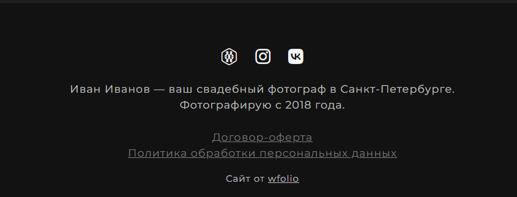

# Настройки сайта

Правильные настройки обеспечивают корректное отображение вашего сайта в поисковых системах, улучшают его видимость и повышают доверие пользователей. Это критически важно для привлечения пользователей на сайт и достижения ваших целей.

### Название (title) сайта заполнено корректно

Название сайта (title) является одним из важнейших факторов продвижения. Оно должно быть уникальным, кратким и включать основной запрос, по которому вас должны найти. Это помогает поисковым системам понять, о чем ваш сайт, и привлекает внимание пользователей.

Например, если ваш сайт посвящен свадебной фотографии, а вы живете в Москве, название сайта может быть таким: _«Иван Иванов — свадебный фотограф в Москве»_.

Важно рассказать о жанре работы, городе в котором вы живете или работаете, и указать имя для формирования личного бренда.

<figure><figcaption>
Пример заполнения названия сайта в главных настройках
</figcaption></figure>

### Описание (description) сайта заполнено корректно

Мета-описание (description) — это короткий текст, который отображается в результатах поиска под заголовком страницы. Описание должно дополнять название сайта, быть информативным и содержать ключевые слова, которые актуальны для вашей сферы деятельности. Это позволит привлечь пользователей и дать им представление о содержании вашего сайта. Оптимальная длина описания — 200-250 символов.

Например: _«Иван Иванов — опытный свадебный фотограф в Москве. Запечатлейте самые яркие моменты вашего важного дня с профессиональными и креативными фотографиями по доступным ценам. На сайте вы можете заказать фотосессию и посмотреть мои работы»_.

<figure><figcaption>
Пример заполнения описания сайта в главных настройках
</figcaption></figure>

### В тексте внизу сайта (footer) указан регион работы

Упоминание города или региона, в котором вы работаете, важно для локального поиска. Это помогает поисковым системам лучше понять, где вы находитесь, и повысить ваши шансы на отображение в результатах локального поиска. В подвале сайта пропишите город или область, в которой вы предоставляете услуги.

<figure><figcaption>
Пример текста внизу сайта с указанием региона или города, где вы работаете
</figcaption></figure>

***

Остались вопросы? [Напишите нам в поддержку](https://t.me/wfoliobot), и мы поможем вам.
