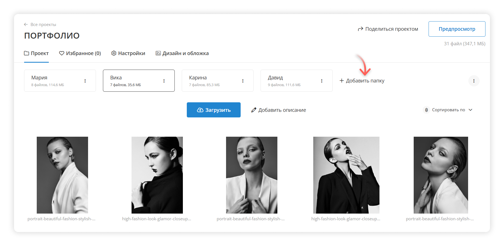

# Папки и управление папками

Воспользуйтесь папками, чтобы разбить съемку на части: распределить файлы по локациям, моделям, объектам съемки и т.д.

Для этого создайте новый проект на диске. Выберите папки на устройстве и перетащите их в проект или создайте папки в проекте по кнопке **«Добавить папку»**.

<figure><figcaption></figcaption></figure>

Структура папок в проекте сохранится в клиентской галерее.

<figure><figcaption>
Папки в галерее на ПК
</figcaption></figure>

<figure><figcaption>
Папки на телефоне в начале и в конце галереи
</figcaption></figure>

[Как перенести файлы из одной папки проекта в другую?](manage-files.md#peremeshenie-failov-mezhdu-papkami)

### Действия с отдельной папкой

Нажмите на **⋮** возле отдельной папки, чтобы вызвать меню действий с папкой.

<figure><figcaption></figcaption></figure>

* **Предпросмотр.** Посмотрите, как выглядят фотографии из папки в клиентской галерее.
* **Настройки.** Измените название папки, ее URL-адрес или описание.
* **Скопировать ссылку.** Поделитесь ссылкой на отдельную папку.
* **Скачать файлы.** Скачайте все файлы из папки на ваше устройство.
* [**Скрыть папку**](hidden-folders.md)**.** После скрытия папки посмотреть ее можно будет по прямой ссылке.
* <mark style="color:red;">**Удалить папку.**</mark> Файлы и папка будут удалены окончательно.

#### Настройки папки

Для папки можно задать **название.** Его видят ваши клиенты в галерее и вы — в панели управления.

**Адрес** папки отображается в ссылке после адреса галереи и может состоять из букв латинского алфавита, цифр и дефиса `-`. Пример: https://demo.wfolio.pro/disk/workshop/**`backstage`**.

**Описание** папки показывается перед файлами в начале галереи. Его можно добавить в настройках папки или по кнопке «Добавить описание». Для разных папок могут быть разные описания. Текст можно отформатировать или сделать ссылкой.

<figure><figcaption></figcaption></figure>

Добавить описание также можно по кнопке «Добавить описание».

<figure><figcaption></figcaption></figure>

### Действия со всеми папками

Нажмите на **⋮** в правой части экрана.

<figure><figcaption></figcaption></figure>

Можно массово [**скрыть**](hidden-folders.md) или **показать** папки в проекте.

Список ссылок на папки можно легко получить в [формате CSV](../selections/csv.md#ssylki-na-papki-v-proekte).

### Скрытые папки 

Скрытая папка не отображается среди остальных папок в галерее, а посмотреть папку можно по прямой ссылке. Подробнее: [hidden-folders.md](hidden-folders.md "mention").
