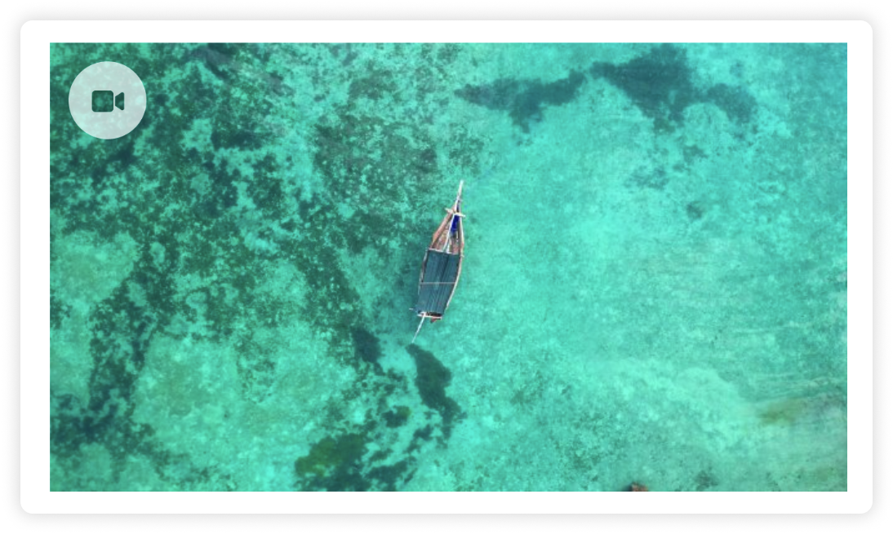
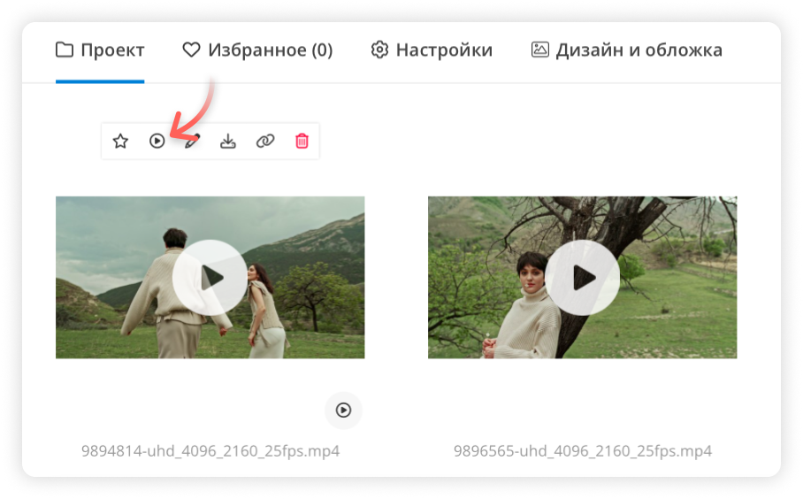
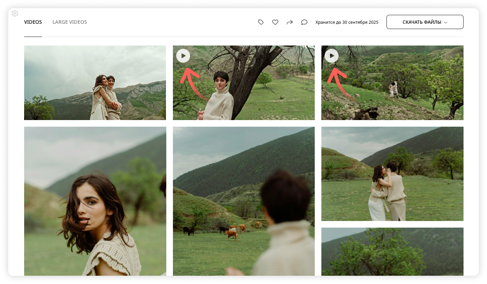

---
layout:
  width: default
  title:
    visible: true
  description:
    visible: true
  tableOfContents:
    visible: true
  outline:
    visible: true
  pagination:
    visible: true
  metadata:
    visible: true
---

# Видео в галерее

Вы можете добавлять видео в галереи, чтобы делиться не только фотографиями, но и динамичным контентом — например, тизерами, бэкстейджем или видеопрезентациями.

#### Какие форматы поддерживаются

Загружайте видеофайлы в одном из следующих форматов:\
✔ **MP4.**\
✔ **MOV.**

Видео должно быть закодировано с помощью **кодека h.264 (AVC)**. Это стандартный формат, поддерживаемый большинством устройств и браузеров.

### Видеоплеер

Если в галерее разрешено скачивание оригиналов, то для всех видео **до 300 МБ** доступен полноэкранный просмотр со звуком.

<figure><figcaption></figcaption></figure>

<figure><figcaption></figcaption></figure>


Если в проекте запрещено скачивание, видео будут недоступны для просмотра на весь экран.


Крупные видео отображаются в виде статичных обложек с иконкой камеры. Чтобы посмотреть такие видео, нужно скачать их на устройство.

<figure><figcaption></figcaption></figure>

<figure><figcaption></figcaption></figure>

> [Пример галереи с видео](https://demo.wfolio.pro/disk/mountains)

#### Автовоспроизведение видео

В галерее видео до 300 МБ могут запускаться автоматически без звука.

Видео, загруженное в [обложку](https://docs.wfolio.pro/gallery/share/cover), будет воспроизводиться по умолчанию. Для других небольших видео, **включите автозапуск в панели управления**:

* Найдите видео до 300 МБ в проекте.
* Наведите на него курсор и нажмите на иконку автозапуска.

<figure><figcaption></figcaption></figure>

Видео до 300 МБ без автозапуска будут отображаться со статичной обложкой и иконкой (▶)

<figure><figcaption></figcaption></figure>
