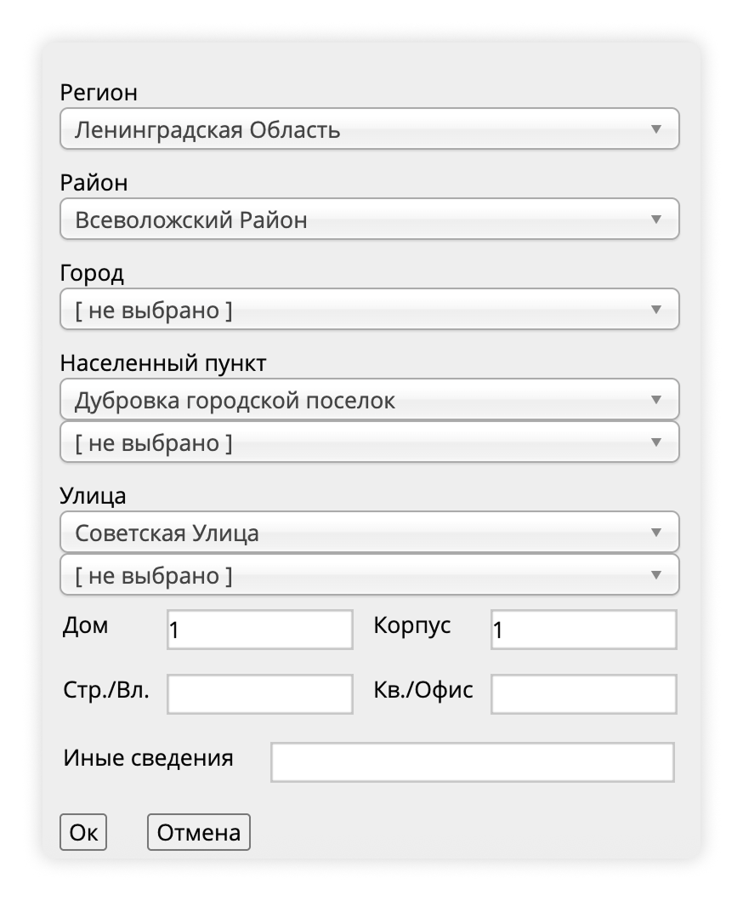

# Подача уведомления в РКН

С 30 мая 2025 года в России увеличились штрафы за несоблюдение закона о персональных данных. Сам закон не меняется (он действует с 2014-го года). Мы подготовили инструкцию по подаче уведомления в Роскомнадзор.

## Кому и для чего нужно подавать уведомление в Роскомнадзор

Уведомление нужно подавать, если вы получаете данные о клиентах с использованием средств автоматизации и/или распространяете их. Например: собираете email-адреса или другую информацию через контактные формы, анализируете статистику сайта через внешние сервисы (с помощью cookies) или публикуете отзывы клиентов на сайте.

**✔ Уведомление подается один раз. Это бесплатно. В течение 30-ти дней Роскомнадзор рассмотрит его и внесет информацию в реестр операторов.**


#### Сбор данных и установка cookies на Wfolio

Cбор данных есть в контактных формах и в формах заказа, в списках избранного (если, кроме имени и фамилии, вы собираете почту и/или телефон). Если в списках избранного нет запроса на ввод почты и/или телефона, **то это не считается сбором персональных данных**.

Ваш сайт не использует cookies, если вы не подключаете внешние виджеты (например: Яндекс Метрика, Пиксель VK, Google Analytics, и другие).


## Когда не нужно подавать уведомление

1. Вы обрабатываете данные клиентов только вручную, без внесения информации в электронные документы.
2. На сайте нет форм для сбора данных о посетителях сайта. Например:
   1. Все заявки вы получаете через WhatsApp или Telegram.
   2. На сайте нет страницы «Отзывы».
3. Вы не запрашиваете **телефон** и/или **почту** в списках избранного на диске. Если только имя и фамилия — уведомление можно не подавать.

## Как подать уведомление 



#### 1. Разместите на сайте политику конфиденциальности

По закону нужно **предупредить** и **получить согласие** посетителей сайта на обработку их данных. Опубликуйте политику конфиденциальности — документ, в котором описаны условия обработки персональных данных и согласие посетителя с этими условиями. Вместе с юристами мы подготовили шаблон, скачайте его [**по ссылке**](https://static.wfolio.ru/file/AqiFFw_TXMM4LDwoI2TPSYAM1lHVLAGB/F3eUE25SDaCzx4bS-1OSsqWmQ3nhW775/xITM0K6vBC8OKruf4d-JkARVM6oJHW9e/qzltsITtFBDmJzcgiZkYU8q7AFKfdDzI/uVnD63ro80I9Yy-b_hf04qnS7lEv6FGx/iFXWp8D8zwQhxEY8EsUNwYp2O3Jq5mNx/nyDZSxltDOKBQW7iYIWPLLnBYzAJglWz/Rj5N8LE4sOo.docx).

Разместите документ на сайте по инструкции: [privacy-policy.md](privacy-policy.md "mention").

#### 2. Составьте и отправьте уведомление

Уведомление можно подать тремя способами:

1. Заполнить электронную форму, распечатать уведомление и направить по почте.
2. Заполнить электронную форму и подписать электронной подписью. Отправлять в бумажном виде не нужно.
3. Авторизоваться через Госуслуги и заполнить электронную форму. Отправлять в бумажном виде не нужно.

Мы рассмотрим, как подать уведомление с авторизацией через Госуслуги. Для этого:

* Перейдите [**на портал РКН**](https://pd.rkn.gov.ru/operators-registry/notification/form/).
* Выберите **«перейти к сервису ЕСИА»**.

<figure><figcaption></figcaption></figure>

* Авторизуйтесь на Госуслугах и выберите роль. Можно войти как физическое лицо, ИП или юридическое лицо.

<figure><figcaption></figcaption></figure>

Форма автоматически заполнит часть сведений об операторе и укажет электронную почту. Можно заполнять другие данные.

### Сведения об операторе

* **Регион регистрации**: регион, где зарегистрированы вы или ваша компания.
* **Адрес оператора**: укажите регион фактического местонахождения (для физических лиц) или адрес регистрации юридического лица.
* **Регионы обработки**: территория, на которой вы обрабатываете персональные данные. Можно указать **«Все субъекты Российской Федерации»**.

### Цели обработки персональных данных 


Если целей несколько, нужно добавить отдельно каждую цель.


* **Цель обработки ПД**: укажите, для чего вы обрабатываете персональные данные. Это могут быть:
  * Подготовка, заключение, исполнение гражданско-правового договора.
  * Или иные цели.
* **Категории персональных данных**. Укажите, какие данные вы собираете:
  * Фамилия, имя, отчество.
  * Адрес электронной почты.
  * Номер телефона.
  * Иные данные, которые вы получаете от клиентов (это могут быть: адрес места жительства, данные документов — и другие, в зависимости от вашего случая).
* **Категории субъектов, персональные данные которых обрабатываются**. Например:
  * Клиенты.
  * Посетители сайта.
  * Или другие категории — в зависимости от вашего случая.
* **Правовое основание обработки персональных данных**: поставьте галочки возле пунктов «обработка персональных данных осуществляется с согласия субъекта» и «обработка персональных данных необходима для исполнения договора».

<figure><figcaption></figcaption></figure>

* В поле ниже впишите основания основания обработки персональных данных, в зависимости от целей обработки:
  * Конституция РФ.
  * Федеральный закон от 27.06.2006 № 152-ФЗ «О персональных данных».
  * Федеральный закон от 27.07.2006 N 149-ФЗ «Об информации, информационных технологиях и о защите информации».
  * Гражданский кодекс Российской Федерации.
  * Постановления правительства и иные нормативно правовые акты Российской Федерации.
  * Политика конфиденциальности Оператора.
  * Если у вас есть работники, добавьте Трудовой кодекс РФ.

<figure><figcaption></figcaption></figure>

* **Перечень действий**: укажите **сбор,** **хранение, запись, использование, удаление, уточнение.** В зависимости от вашей ситуации могут быть и другие действия. Подробнее в таблице:

| Действие с данными                | Что означает                                                                                          |
| --------------------------------- | ----------------------------------------------------------------------------------------------------- |
| Запись                            | Фиксация данных на носителе (на бумажном документе или в электронном файле)                           |
| Использование                     | Применение данных в рабочих или иных целях                                                            |
| Передача (предоставление, доступ) | Передача данных третьим лицам или предоставление возможности доступа к данным (например, сотрудникам) |
| Распространение                   | Раскрытие данных неопределенному кругу лиц — если персональные данные публикуются на сайте            |
| Обезличивание                     | Преобразование данных, исключающее идентификацию личности, — если сайт или диск используют cookies    |
| Удаление                          | Удаление данных без уничтожения с физических носителей                                                |

* **Способы обработки:**
  * смешанная;
  * без передачи по внутренней сети юридического лица;
  * с передачей по сети Интернет.
* **Описание мер, предусмотренных статьями 18.1. и 19 Федерального закона «О персональных данных»:** указываются меры, предусмотренные [статьей 18.1](https://www.consultant.ru/document/cons_doc_LAW_61801/eeeebe22bf738fd65bb66b95cc278911ae2525ee/) и [статьей 19](https://www.consultant.ru/document/cons_doc_LAW_61801/ca9e5658710519f09ab2fdb8196fcb3eb024a051/#dst100368) закона. Вы можете указать:
  * Издание документа (локального регламента) для обеспечения соблюдения N 152-ФЗ.
  * Разработка и издание локальных актов по вопросам обработки персональных данных.
  * Осуществление внутреннего контроля за процессом обработки персональных данных.
  * Учет носителей персональных данных.
  * Установление правил доступа к персональным данным.
  * Контроль за принимаемыми мерами по обеспечению безопасности.
* **Средства обеспечения безопасности.** Укажите:
  * Использование антивирусных средств защиты информации.
  * Идентификация и проверка подлинности пользователя при входе в информационную систему.
  * Ключи, пароли.
* **Использование шифровальных (криптографических) средств**: не используются.
* **Ответственный за организацию обработки персональных данных**: укажите одного человека, который будет отвечать за обработку данных перед проверяющими органами. Это можете быть вы или ответственный сотрудник вашей организации.\
  Оставьте только рабочие контакты — информация об ответственном будет в открытом доступе.
* **Дата начала обработки персональных данных**: укажите дату подачи уведомления.
* **Срок или условие прекращения обработки персональных данных**: выберите **«Условие окончания»**. Напишите: «До достижения целей обработки или до отзыва согласия субъектом, если иное не предусмотрено законодательством Российской Федерации».
* **Осуществление трансграничной передачи персональных данных**: если не передаете данные третьим лицам или сервисам вне России, укажите **«не осуществляется»**.

### Сведения о местонахождении базы данных

Вы используете базу данных от Selectel. Укажите адреса и заполните форму, как показано ниже.

#### База данных

* **Страна**: Россия.
* **Адрес ЦОДа**: Ленинградская Область, Всеволожский Район, Дубровка городской поселок, Советская Улица, дом 1, корп. 1.
* **Собственный ЦОД**: нет.

<figure><figcaption>
Как указать адрес ЦОДа
</figcaption></figure>

#### Сведения об организации, ответственной за хранение данных

* **Тип организации**: юридическое лицо.
* **Организационно-правовая форма**: акционерные общества.
* **Наименование организации**: АО «Селектел».
* **ОГРН**: 1247800067790.
* **ИНН**: 7810962785.
* **Страна местонахождения организации, ответственной за хранение данных**: Россия.
* **Адрес местонахождения организации, ответственной за хранение данных**:&#x20;
  * **Регион**: Санкт-Петербург Город
  * **Улица**: Цветочная Улица
  * **Дом**: 21А.

<figure><figcaption>
Как указать адрес организации, ответственной за хранение данных
</figcaption></figure>

<figure><figcaption>
Сведения о базе данных
</figcaption></figure>

Пункт «Сведения о лицах, имеющих доступ и (или) осуществляющих на основании договора обработку персональных данных, содержащихся в государственных и муниципальных информационных системах» удалите.

<figure><figcaption></figcaption></figure>

### Сведения об обеспечении безопасности персональных данных

* **Сведения об обеспечении безопасности персональных данных в соответствии с требованиями к защите персональных данных, установленными Правительством РФ**: Обеспечение сохранности носителей персональных данных. Использование средств защиты информации (пароли, двухфакторная идентификация, обновление программного обеспечения).

В сведениях об исполнителе укажите свои данные и нажмите на кнопку **«Отправить»**. В течение 30-ти дней Роскомнадзор рассмотрит уведомление и внесет информацию об операторе в [реестр операторов](https://pd.rkn.gov.ru/operators-registry/operators-list/).

### Частые вопросы 

* **Если вся информация проходит через Wfolio, мне нужно подавать уведомление?**\
  Да, в этом случае вы — оператор персональных данных, так как клиенты передают свои данные вам.\
  Wfolio не осуществляет обработку собираемых персональных данных, а только предоставляет вычислительные мощности, которые могут использоваться вами для сбора данных.
* **Если на сайте есть только ссылки на соцсети и мессенджеры, нужно подавать уведомление?**\
  Нет, не нужно. В таком случае вы общаетесь с клиентом через мобильный телефон. Даже если вы получаете данные от клиента по переписке,  уведомлять РКН не нужно. Об этом нам сообщил  Роскомнадзор в официальном письме.
* **Можно ли полностью отключить сбор данных на сайте?**\
  Правильно оформленное уведомление в Роскомнадзор позволит вам комфортно работать и развивать свой бизнес без риска получить штраф — рекомендуем сделать это по инструкциям выше.\
  Здесь [#kogda-ne-nuzhno-podavat-uvedomlenie](rkn.md#kogda-ne-nuzhno-podavat-uvedomlenie "mention") описали случаи, когда уведомление можно не подавать.
* **Мне нужно подавать уведомление, если мои клиенты живут в России, а я** — **нет?**\
  Да, если вы обрабатываете персональные данные граждан России, нужно подать уведомление. В Роскомнадзоре можно зарегистрироваться в качестве иностранного оператора данных.
