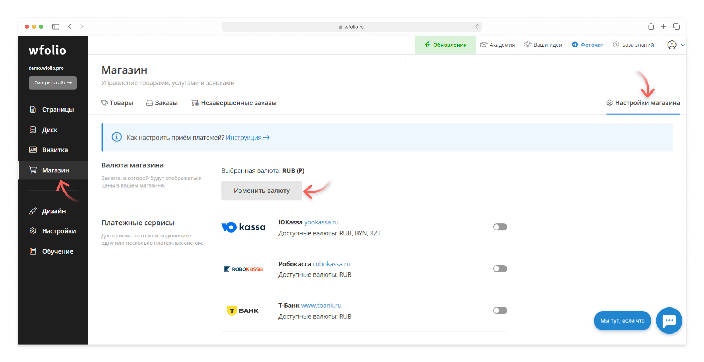

# Валюта магазина

После регистрации у вашего магазина будет установлена валюта в зависимости от вашего региона.

Чтобы изменить валюту магазина, перейдите в раздел **«Настройки магазина»** и выберите другую валюту по кнопке **«Изменить валюту»**. Для одного сайта подключается одна валюта.

<figure><figcaption></figcaption></figure>

После изменения валюты не забудьте отредактировать цены для товаров в магазине.


Обратите внимание, что выбранная вами валюта может быть недоступна для приема платежей онлайн. Для разных регионов подключаются разные [платежные системы](payment-systems.md), которые работают с определенным набором валют.

